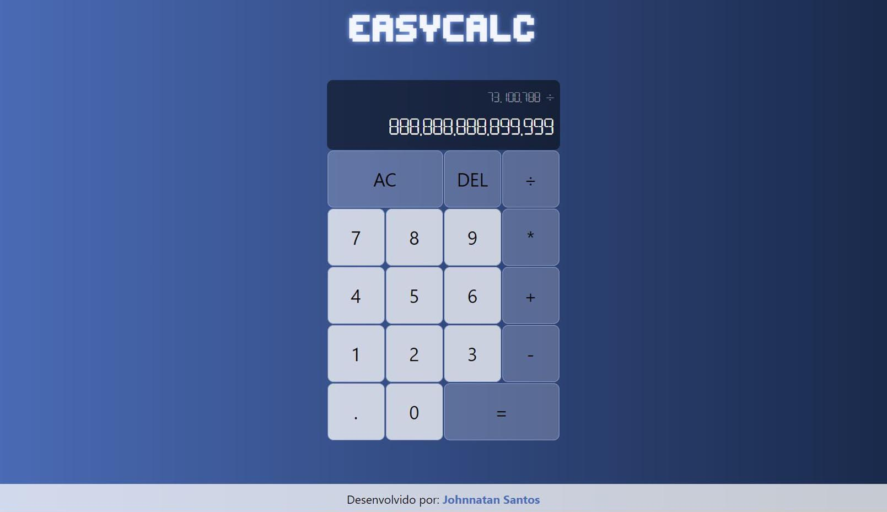

# EasyCalc
## Hello everyone! This is my first exercise creating a simple calculator to learn some skills. 

To code that i use this stacks: 

+ HTML5
+ CSS3
+ JavaScript

## See how the layout is: 

 

### Please feel free to submit improvements and suggestions. Thank you! 

